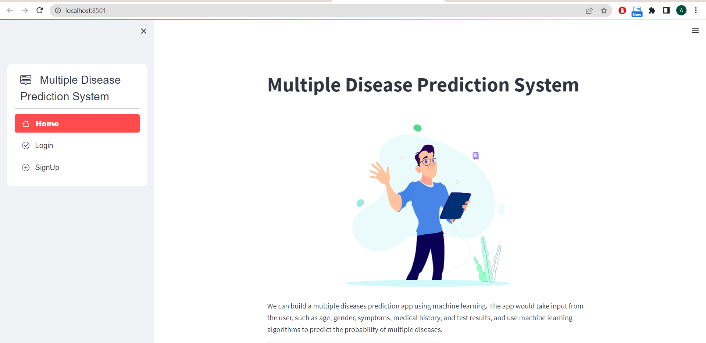
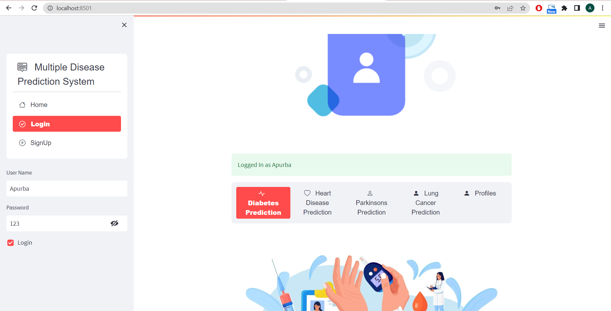
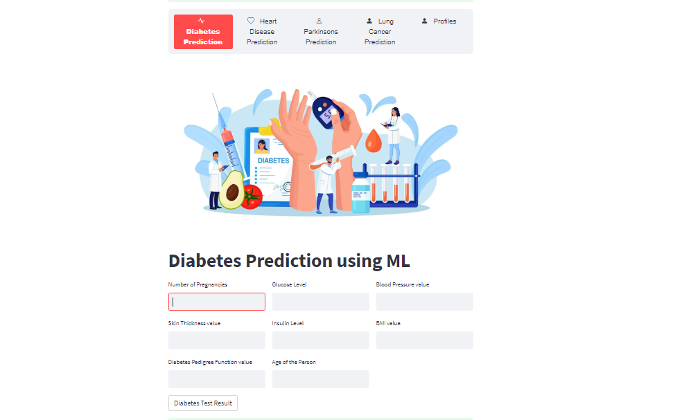

# Human Disease Prediction Web App

This project is a web application built with Streamlit and machine learning to predict the likelihood of several common diseases: Diabetes, Heart Disease, Parkinson's Disease, and Lung Cancer.

## Overview

This application provides a user-friendly interface for individuals to input their health-related information and receive predictions about their risk of developing certain diseases. It uses pre-trained machine learning models for predictions. It also includes basic user authentication and profile viewing capabilities.

**Important Note:** The predictions provided by this application are for informational purposes only and should not be considered medical diagnoses. Always consult with a qualified healthcare professional for any health concerns.

## Features

*   **Disease Prediction:** Predicts the likelihood of:
    *   Diabetes
    *   Heart Disease
    *   Parkinson's Disease
    *   Lung Cancer
*   **User Authentication:** Basic login and signup functionality to manage user profiles.
*   **User Profiles:** Allows users to view their profile information (username).
*   **Interactive UI:** Built with Streamlit for a simple and interactive user experience.
*   **Lottie Animations:** Uses Lottie animations for enhanced visual appeal.

## Datasets Used

The machine learning models were trained using the following datasets from Kaggle:

*   **Diabetes:** [Diabetes Dataset](https://www.kaggle.com/datasets/kandij/diabetesdataset)
*   **Heart Disease:** [Heart Disease Dataset](https://www.kaggle.com/datasets/johnsmith88/heart-disease-dataset)
*   **Parkinson's Disease:** [Parkinson's Dataset](https://www.kaggle.com/datasets/gargmanas/parkinsonsdataset)
*   **Lung Cancer:** [Lung Cancer Dataset](https://www.kaggle.com/datasets/mysarahmadbhat/lung-cancer)

## Technologies Used

*   Python
*   Streamlit
*   Pandas
*   Pickle
*   SQLite
*   Hashlib
*   Streamlit Option Menu
*   PIL (Pillow)
*   Requests
*   Streamlit Lottie
*   Anaconda (for environment management)

## How to Run

1.  **Clone the Repository:**
    ```bash
    git clone https://github.com/Apurba0012/Human-Disease-Prediction.git
    ```
2.  **Navigate to the Project Directory:**
    ```bash
    cd Human-Disease-Prediction/webapp # Navigate to the webapp directory
    ```
3.  **Create a Conda Environment (Recommended):**
    ```bash
    conda create -n disease_prediction python=3.9  # Or your preferred Python version
    conda activate disease_prediction
    ```
4.  **Install Dependencies:**
    ```bash
    pip install streamlit pandas pickle streamlit-option-menu pillow requests streamlit-lottie
5.  **Run the Streamlit App:**
    ```bash
    streamlit run multiple_disease_prediction.py # Replace your_main_script_name.py with the name of your main python file. Usually app.py or main.py.
    ```

## Screenshots

Here are some screenshots of the application:
### Main Screen



### Add Item Screen



